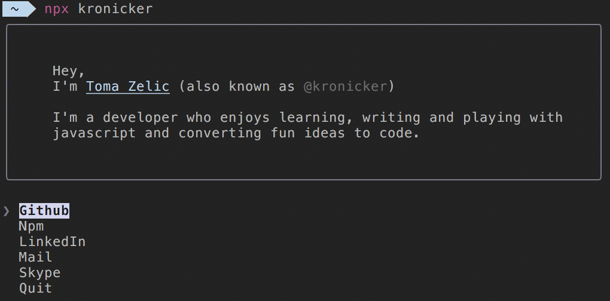

# kronciker [](https://npm.im/kronicker) [](https://github.com/kronicker/kronicker/blob/master/LICENSE)

> kronicker's CLI



## Usage

Install Node.js, then:

```
$ npx kronicker
```

## Acknowledgments

Inspired by @sindresorhus's awesome [CLI](https://github.com/sindresorhus/sindresorhus).
